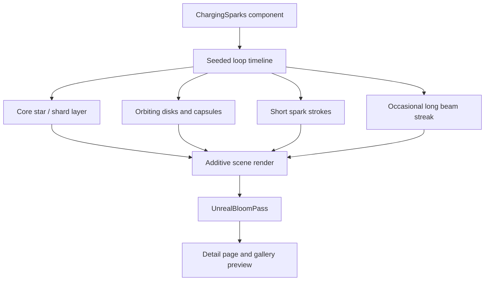

# feat: Add Charging Sparks effect

## Summary

Add a new effects gallery entry that recreates the X reference video from Rémi SL: a dark PopcornFX-style charging sparks idle loop made from simple glowing shapes, center bursts, orbiting pills, triangular shards, and occasional long electric streaks. The implementation will use the existing Next.js App Router and Three.js/R3F effect patterns without embedding the source video.

---

## Problem Frame

The gallery already demonstrates shader, fluid, cloth, glass, and neural-network effects, but it does not yet include a compact realtime VFX particle showcase. The reference video is a 20.6 second loop showing a stylized charge core on a smoky black stage, so the new effect should feel like a production VFX study rather than a generic particle demo.

---

## Assumptions

*This plan was authored without synchronous user confirmation. The items below are agent inferences that fill gaps in the input -- un-validated bets that should be reviewed before implementation proceeds.*

- "一比一" means matching the visible timing, composition, shape vocabulary, and mood closely, not downloading or re-hosting the original X video.
- The effect should become a normal first-class gallery item with preview and detail route, matching the existing gallery architecture.
- Browser visual verification is the primary acceptance signal because the repo currently has no dedicated visual regression or component test harness.

---

## Requirements

- R1. Analyze and preserve the reference video's visual language: smoky dark background, tiny central charge core, bright additive glow, simple geometric particles, and idle-loop timing.
- R2. Implement a new `/effects/charging-sparks` detail page and gallery card with a live preview.
- R3. Use the existing frontend stack and conventions: Next.js App Router, client component boundary for browser/WebGL work, CSS module styling, and Three.js/R3F where appropriate.
- R4. Keep the effect performant in both detail and preview variants, with lower particle density or scale in preview mode if needed.
- R5. Document the visual breakdown and implementation notes in the effect README.
- R6. Verify the final result in a browser, including that the canvas is nonblank, animated, framed similarly to the reference, and visible inside the gallery card.

---

## Scope Boundaries

- Do not embed, download, or depend on the original X-hosted video asset at runtime.
- Do not add a new global design system or unrelated gallery refactor.
- Do not introduce a heavy particle-engine dependency; the existing Three.js stack is enough for this bounded effect.
- Do not make a marketing page or explanatory landing screen; the first viewport remains the actual usable visual effect.

### Deferred to Follow-Up Work

- Automated pixel-diff visual regression can be added later if the project adopts a browser test harness.

---

## Context & Research

### Relevant Code and Patterns

- `src/app/effects/page.tsx` owns the gallery list, imports each preview component, and supplies index/name/summary/stack metadata.
- Existing effect routes use `src/app/effects/<effect>/page.tsx`, a colocated client component, a CSS module, and `README.md`.
- `src/app/effects/quantum-neural-network/quantum-neural-network.tsx` shows the established Three.js plus `EffectComposer` and `UnrealBloomPass` pattern.
- `src/app/effects/liquid-metal-button/liquid-metal-button.tsx` shows the established WebGL animation lifecycle pattern for a detail/preview component with `variant` prop.
- `node_modules/next/dist/docs/01-app/03-api-reference/01-directives/use-client.md` confirms browser APIs and eventful UI belong behind a top-level `'use client'` boundary.

### Reference Video Observations

- Source: `https://x.com/damotime/status/2054584815849021838`.
- Visible post text: "Stylized charging sparks iddle using simple shapes on #PopcornFx ! #realtimeVFX #VFX".
- Video metadata observed in browser: 640x360, about 20.6 seconds, looping idle VFX.
- Key frames show a small centered charge shape with pink/purple, cyan/green, and yellow/green color phases.
- Shape vocabulary: star-like core, angular triangle shards, lightning-zigzag strokes, thin diagonal beam lines, round disks, soft circles, capsules, and tiny rectangular sparks.
- Motion vocabulary: short radial ejections, orbital drift, snappy shape-scale pops, fast fade-outs, flickering core brightness, and occasional long diagonal streaks crossing the core.

### Institutional Learnings

- No `docs/solutions/` learnings exist in this repo yet.

### External References

- No additional external research is needed; the relevant implementation patterns already exist in the repo and the user supplied the reference URL.

---

## Key Technical Decisions

- Implement with Three.js/R3F and `UnrealBloomPass`: this matches the existing high-glow effect pattern and is the fastest route to convincing additive neon.
- Use deterministic procedural timelines: seeded bursts and looping math should make the idle repeat stable without storing a video or sprite sheet.
- Separate detail and preview rendering: detail mode can use more fragments, longer beams, and larger bloom; preview mode should reduce counts and camera scale for gallery performance.
- Use simple custom geometries/materials instead of imported assets: the reference explicitly uses simple shapes, so generated circles, capsules, triangles, and line quads fit the source.
- Keep surrounding UI restrained: the stage should be mostly black, with the effect itself as the first signal.

---

## Open Questions

### Resolved During Planning

- Should the original X video be embedded? No. The new effect should be a realtime implementation, not a runtime dependency on the source media.
- Does this require a dedicated particle engine? No. The visual is primarily simple geometric particles, additive blending, bloom, and tuned timing.

### Deferred to Implementation

- Exact bloom strength and color timing: final values should be tuned against browser screenshots because they depend on canvas size and device pixel ratio.
- Exact particle counts in preview mode: choose after checking gallery frame rate and visual density.

---

## Output Structure

```text
src/app/effects/charging-sparks/
  page.tsx
  charging-sparks.tsx
  charging-sparks.module.css
  README.md
```

---

## High-Level Technical Design

> *This illustrates the intended approach and is directional guidance for review, not implementation specification. The implementing agent should treat it as context, not code to reproduce.*



---

## Implementation Units

- U1. **Reference-shaped realtime VFX component**

**Goal:** Create the client-side Three.js/R3F component that renders the charging sparks loop.

**Requirements:** R1, R3, R4

**Dependencies:** None

**Files:**
- Create: `src/app/effects/charging-sparks/charging-sparks.tsx`
- Create: `src/app/effects/charging-sparks/charging-sparks.module.css`
- Test: none -- the repo has no component or visual regression harness; verification is browser-based for this visual unit.

**Approach:**
- Build a compact 2.5D scene with an orthographic or narrow perspective camera centered on a dark stage.
- Generate a deterministic set of burst events over a roughly 20-second loop so colors, beams, and particles feel intentional rather than random noise.
- Represent shapes as simple meshes or instanced meshes: disks, capsules, triangles, small line quads, zigzag strokes, and a central star-like shard cluster.
- Use additive blending and bloom for the luminous core, but keep the background soft and low contrast to match the reference.
- Add concise Chinese comments around the timeline/particle scheduling logic because that is the easiest part to misunderstand later.

**Patterns to follow:**
- `src/app/effects/quantum-neural-network/quantum-neural-network.tsx` for Three.js lifecycle and bloom.
- `src/app/effects/liquid-metal-button/liquid-metal-button.tsx` for detail/preview variant separation.

**Test scenarios:**
- Happy path: loading the detail variant shows a nonblank centered charge core on a dark stage.
- Happy path: the loop shows at least three visible color phases, including magenta/purple and green/yellow.
- Integration: switching to preview variant renders a smaller/lighter version without layout overflow inside the gallery card.
- Edge case: resizing the viewport keeps the core centered and does not distort the 16:9 visual composition.
- Performance: animation remains smooth with DPR clamped and object counts reduced in preview mode.

**Verification:**
- Browser screenshots show a central glowing core, surrounding simple shapes, and long diagonal streak moments similar to the reference frames.
- No canvas blanking, console errors, or runaway object allocation during several loop seconds.

- U2. **Route, gallery card, and styling integration**

**Goal:** Expose the new effect as a normal gallery item and detail page.

**Requirements:** R2, R3, R4

**Dependencies:** U1

**Files:**
- Create: `src/app/effects/charging-sparks/page.tsx`
- Modify: `src/app/effects/page.tsx`
- Test: none -- existing gallery routes are manually/browser verified rather than covered by route tests.

**Approach:**
- Add a detail page using the existing `EffectBackLink`, `detailShell`, and `detailStage` conventions.
- Insert the new effect into `src/app/effects/page.tsx` with summary and stack metadata that accurately describe the realtime VFX implementation.
- Keep display text compact and avoid in-app instructional copy.

**Patterns to follow:**
- `src/app/effects/liquid-metal-button/page.tsx`
- `src/app/effects/page.tsx`

**Test scenarios:**
- Happy path: `/effects` displays a new Charging Sparks card with a live preview and an open link.
- Happy path: `/effects/charging-sparks` renders the full detail effect with the existing back link.
- Integration: navigating from the gallery card to the detail route works via Next `Link`.
- Edge case: mobile-width layout keeps the card text and preview contained without overlap.

**Verification:**
- Gallery and detail screenshots show the effect framed consistently with existing effects.

- U3. **Effect README and visual breakdown**

**Goal:** Document the source analysis, implementation approach, and verification expectations for future tuning.

**Requirements:** R1, R5, R6

**Dependencies:** U1, U2

**Files:**
- Create: `src/app/effects/charging-sparks/README.md`
- Test: none -- documentation-only unit.

**Approach:**
- Summarize the observed reference elements: core, simple shapes, color phases, diagonal beams, smoke, and loop timing.
- Explain the local implementation architecture and which parameters are useful for future tuning.
- Record local run and verification expectations without over-specifying exact commands in the plan.

**Patterns to follow:**
- `src/app/effects/quantum-neural-network/README.md`
- `src/app/effects/liquid-metal-button/README.md`

**Test scenarios:**
- Test expectation: none -- documentation-only unit.

**Verification:**
- README gives enough context for a later contributor to adjust timing, colors, density, and bloom without rereading the X thread.

---

## System-Wide Impact

- **Interaction graph:** Adds one gallery route, one gallery preview, and one client-rendered WebGL effect. It does not touch global layout, article rendering, or deployment configuration.
- **Error propagation:** WebGL initialization failures should fail gracefully inside the component area rather than breaking unrelated pages.
- **State lifecycle risks:** Animation loops, renderer instances, geometries, materials, and postprocessing passes must be disposed on unmount.
- **API surface parity:** The new component should accept the same `variant?: "detail" | "preview"` shape used by existing effects.
- **Integration coverage:** Browser verification must cover both `/effects` and `/effects/charging-sparks`.
- **Unchanged invariants:** Existing effect routes and gallery metadata should continue to render unchanged.

---

## Risks & Dependencies

| Risk | Mitigation |
|------|------------|
| The result looks like generic particles rather than the reference VFX | Use the observed shape vocabulary and tune against captured key frames, especially the core shard and long diagonal beam moments. |
| Bloom overwhelms the small shapes | Tune detail and preview bloom separately and keep the background low contrast. |
| Gallery performance regresses | Lower preview density, clamp DPR, and dispose Three.js resources on unmount. |
| Mobile framing crops the effect | Use responsive stage sizing with a stable 16:9 composition and verify mobile screenshots. |

---

## Documentation / Operational Notes

- Update only the new effect README; no deployment or runtime configuration changes are expected.
- The final PR should include browser verification evidence because visual fidelity is the core acceptance criterion.

---

## Sources & References

- Reference post: `https://x.com/damotime/status/2054584815849021838`
- Related code: `src/app/effects/page.tsx`
- Related code: `src/app/effects/quantum-neural-network/quantum-neural-network.tsx`
- Related code: `src/app/effects/liquid-metal-button/liquid-metal-button.tsx`
- Next.js client component docs: `node_modules/next/dist/docs/01-app/03-api-reference/01-directives/use-client.md`
