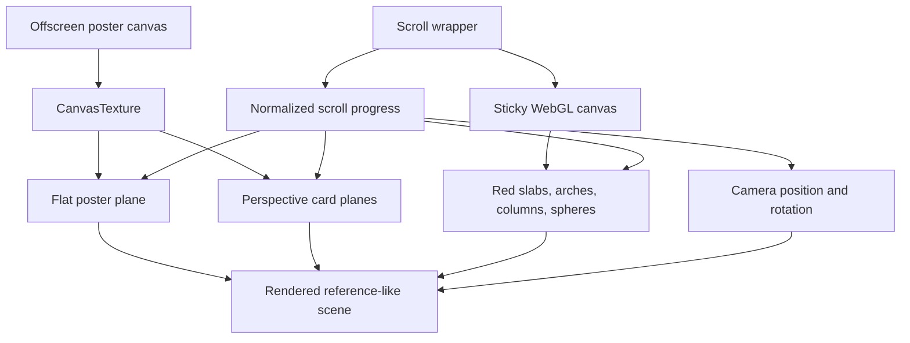

# feat: Add Three HTML Canvas scroll effect

## Summary

Add a new effects-gallery entry that recreates `https://cullenwebber.github.io/three-html-to-canvas/`: a fixed, full-screen WebGL stage where a flat editorial HTML layout becomes a 3D canvas scene as the user scrolls. The implementation should preserve the reference's white/red/black palette, oversized typography, centered red content panel, offscreen HTML-to-texture source, and scroll-driven depth transformation.

---

## Problem Frame

The gallery already includes WebGL, canvas, and HTML-to-canvas inspired effects, but it does not yet have a pure scroll-driven "HTML page becomes 3D object" study. The requested effect is about style changing after scroll: the page starts as a flat poster-like layout, then the same visual material appears warped in perspective with red extruded UI forms, rounded arches, vertical pillars, white spheres, and shadow-like black text planes.

---

## Assumptions

*This plan was authored without synchronous user confirmation. The items below are agent inferences that fill gaps in the input and should be reviewed if the scope changes.*

- "1:1" means matching the observable motion, composition, palette, typography hierarchy, and scroll phase behavior closely, not cloning private source code.
- The effect should become a normal first-class gallery route under `/effects`, with a live preview card.
- Runtime should not depend on the remote reference page. Local rendering should be procedural and self-contained.
- Browser visual verification is the main acceptance signal because this repo does not currently include a visual regression harness.

---

## Requirements

- R1. Analyze and reproduce the reference's scroll phases: flat editorial layout at the top, perspective 3D transformation in the middle, and return/loop-style continuity across the scroll range.
- R2. Implement a new `/effects/three-html-canvas` detail page and gallery preview.
- R3. Use the existing Next.js App Router architecture: server `page.tsx`, client-only interactive component, colocated CSS module, and `README.md`.
- R4. Render the first viewport as the actual effect, not a marketing or explanatory landing page.
- R5. Keep the effect responsive across desktop and mobile, with stable text containment and no incoherent overlaps outside the intentional reference-style composition.
- R6. Include concise Chinese comments around complex scroll mapping, texture capture, and Three.js scene lifecycle logic.
- R7. Verify that the canvas is nonblank, scroll-driven, visually close to the reference, and integrated into both gallery and detail routes.

---

## Scope Boundaries

- Do not scrape, embed, or hotlink the remote page at runtime.
- Do not add a new global design system, routing pattern, or unrelated gallery refactor.
- Do not depend on a heavy browser screenshot library for every frame; local canvas texture generation is preferred if it can match the visual.
- Do not exceed the 1000-line single-file guideline. Split texture generation, Three.js component code, or CSS if a file approaches the limit.

### Deferred to Follow-Up Work

- Automated pixel-diff regression against reference screenshots can be added later if the project adopts a browser test harness.
- Fine-grained inertial scroll smoothing can be enhanced later if native scroll plus easing is not enough.

---

## Context & Research

### Repo Patterns

- `src/app/effects/page.tsx` owns the gallery list and imports every preview component.
- Existing effect detail pages use `src/app/effects/<effect>/page.tsx`, `EffectBackLink`, `detailShell`, and `detailStage`.
- Existing client effects colocate a `variant?: "detail" | "preview"` prop with a CSS module and README.
- `node_modules/next/dist/docs/01-app/01-getting-started/03-layouts-and-pages.md` confirms App Router pages are file-system route leaves.
- `node_modules/next/dist/docs/01-app/01-getting-started/05-server-and-client-components.md` confirms browser APIs, `useEffect`, and eventful rendering belong in client components.

### Reference Observations

- Source: `https://cullenwebber.github.io/three-html-to-canvas/`.
- Page title: `Three HTML Canvas`.
- DOM includes a fixed WebGL canvas covering the viewport and a fixed `.min-h-lvh` HTML source positioned far offscreen at `x = -2560`.
- The top phase shows a white page with giant black editorial headings: `Designing`, `Motion`, `Crafting`, `Depth`, `Into`, `Living`, `Worlds`.
- A centered square red panel contains `Cullen Webber ™`, short bold paragraph text, smaller body text, and a minimal logo-like SVG mark.
- `SCROLL DOWN` sits near the bottom center in bold black text.
- During scroll, the canvas content becomes a perspective scene: the red panel skews into a rounded rectangular slab, duplicate red cards recede, red-white arches and vertical columns appear, white spheres sit in front, and black text planes stretch/tilt across the floor and background.
- The document scroll height is about five viewport heights, but the visible canvas remains fixed. Scroll updates the rendered scene rather than moving normal page DOM.

### Institutional Learnings

- No `docs/solutions/` learnings exist in this repo yet.

---

## Key Technical Decisions

- Use a single client component with a fixed-height scroll wrapper and sticky canvas stage. This matches the reference's "fixed canvas, scrolling timeline" behavior while keeping route integration simple.
- Use Three.js directly for scene construction. Existing repo effects already depend on Three.js, and the target relies on perspective, camera movement, planes, extrusions, and scroll-driven transforms.
- Generate the poster texture locally from a hidden/offscreen HTML-like layout drawn into a 2D canvas. This gives a dependable texture without adding html2canvas as a runtime dependency.
- Build the 3D phase from the same visual vocabulary instead of trying to warp one plane only: textured poster/card planes for HTML continuity, red rounded slabs, white arches, red-white cylinders, spheres, and black text-shadow floor planes.
- Interpolate a normalized scroll progress into camera, object positions, rotations, opacity, and scale. Keep easing inside the component so native scroll remains the input but the scene avoids harsh snapping.
- Add the effect to the gallery as item 13 after existing entries, avoiding index renumbering and unrelated content churn.

---

## Open Questions

### Resolved During Planning

- Does the visible page use real DOM for the effect? No. The readable DOM is fixed offscreen; a WebGL canvas is what the user sees.
- Is the scroll change mainly CSS? No. The style change is a canvas-rendered 3D scene driven by scroll position.
- Is a server component enough? No. Browser scroll, canvas, and Three.js lifecycle require a client component boundary.

### Deferred to Implementation

- Exact camera focal length and object spacing should be tuned against screenshots after the first browser pass.
- The preview card may need reduced geometry or a static phase if multiple gallery canvases hurt performance.

---

## Output Structure

```text
src/app/effects/three-html-canvas/
  page.tsx
  three-html-canvas.tsx
  three-html-canvas.module.css
  README.md
```

---

## High-Level Technical Design



---

## Implementation Units

- U1. **Scroll-driven Three HTML Canvas component**

**Goal:** Create the client-side effect component that renders the flat-to-3D scroll transformation.

**Requirements:** R1, R4, R5, R6

**Dependencies:** None

**Files:**
- Create: `src/app/effects/three-html-canvas/three-html-canvas.tsx`
- Create: `src/app/effects/three-html-canvas/three-html-canvas.module.css`
- Test: none -- visual/browser verification is used for this feature.

**Approach:**
- Use `"use client"` and keep Three.js, scroll listeners, `ResizeObserver`, and animation frame code inside the client component.
- Render a sticky canvas inside a tall scroll wrapper in detail mode; preview mode should render a compact animated or fixed representative phase without requiring page scroll.
- Draw the reference-like editorial layout into a 2D canvas texture: white background, giant black headings, red square content card, `Cullen Webber ™`, and bottom `SCROLL DOWN`.
- Create a Three.js scene with an orthographic or perspective camera and flat poster plane for progress near 0.
- Add 3D phase objects: multiple red rounded boxes or rounded planes, arches, vertical red-white cylinders, white spheres, black text-shadow planes, and background/floor copies of the poster texture.
- Map scroll progress through eased phases so the flat poster gives way to the 3D composition around the middle of the scroll range.
- Dispose renderer, geometries, materials, textures, and animation frame on unmount.

**Patterns to follow:**
- `src/app/effects/procedural-computer/procedural-computer.tsx` for low-level WebGL/canvas lifecycle.
- `src/app/effects/quantum-neural-network/quantum-neural-network.tsx` for Three.js lifecycle patterns.
- `src/app/effects/living-matter-card/living-matter-card.tsx` for HTML-like texture/refraction precedent.

**Test scenarios:**
- Happy path: `/effects/three-html-canvas` first viewport shows a white page, large black typography, centered red panel, and bottom scroll prompt.
- Scroll path: after scrolling down, the visible scene changes into a perspective 3D composition with skewed red panels, arches/columns, white spheres, and black text planes.
- Continuity: scrolling back to the top restores the flat poster composition.
- Resize: desktop and mobile widths keep the canvas full-bleed and centered with no accidental blank margins.
- Cleanup: navigating away stops animation and does not leave console errors.

**Verification:**
- Browser screenshots at top/middle/lower scroll positions are nonblank and visually align with the captured reference screenshots.

- U2. **Route and gallery integration**

**Goal:** Expose the effect through the normal gallery and detail route.

**Requirements:** R2, R3, R7

**Dependencies:** U1

**Files:**
- Create: `src/app/effects/three-html-canvas/page.tsx`
- Modify: `src/app/effects/page.tsx`
- Test: none -- existing route additions are manually/browser verified in this repo.

**Approach:**
- Add a detail page using `EffectBackLink`, `detailShell`, and `detailStage` unless the effect needs a full-bleed wrapper to preserve the reference. If full-bleed is needed, keep the existing back link visible and avoid nested cards.
- Import the preview component into `src/app/effects/page.tsx` and add a new gallery item with index `13`.
- Add a `previewFrame :global([data-effect="three-html-canvas"])` rule if needed so gallery layout remains stable.

**Patterns to follow:**
- `src/app/effects/charging-sparks/page.tsx`
- `src/app/effects/page.tsx`
- `src/app/effects/effects-gallery.module.css`

**Test scenarios:**
- `/effects` displays the new card and live preview without breaking pagination.
- The new card's `Open effect` link navigates to `/effects/three-html-canvas`.
- `/effects/three-html-canvas` renders the effect and existing back link.
- Mobile gallery view keeps text, preview, and link contained.

**Verification:**
- Browser screenshots for `/effects` and `/effects/three-html-canvas` show correct integration.

- U3. **README documentation**

**Goal:** Record reference analysis and implementation notes for future tuning.

**Requirements:** R1, R6, R7

**Dependencies:** U1, U2

**Files:**
- Create: `src/app/effects/three-html-canvas/README.md`
- Test: none -- documentation-only unit.

**Approach:**
- Summarize the reference structure, captured scroll phases, and local implementation architecture.
- Document how scroll progress maps to flat/poster and 3D/depth phases.
- Note browser verification expectations and important tuning constants.

**Patterns to follow:**
- `src/app/effects/charging-sparks/README.md`
- `src/app/effects/living-matter-card/README.md`

**Test scenarios:**
- Documentation explains enough for another contributor to adjust camera, scroll timing, typography scale, and object placement without redoing the full reference study.

---

## System-Wide Impact

- Adds one new route and one new gallery card.
- Adds one client-side Three.js animation that listens to scroll and resize events.
- Does not change article rendering, i18n, deployment config, or existing effect routes.
- The new component must manage its lifecycle carefully because it owns a renderer, textures, materials, geometries, and animation frame.

---

## Risks & Dependencies

| Risk | Mitigation |
|------|------------|
| The result looks like generic 3D blocks rather than the reference | Preserve the exact palette, oversized typography, red content card, arches/columns/spheres, and black text-plane vocabulary from screenshots. |
| Canvas texture text is blurry on high-DPR displays | Render the source texture at a high fixed resolution and clamp renderer DPR. |
| Preview mode causes gallery performance issues | Reduce animation scope in preview mode and avoid attaching page scroll listeners there. |
| Full-bleed detail route conflicts with shared `detailStage` framing | Use the existing shell where possible, but allow the component to own full viewport height inside the stage. |
| Scroll progress feels jumpy | Smooth displayed progress toward target progress in the render loop. |

---

## Browser Verification Plan

- Start the Next.js dev server.
- Capture `/effects/three-html-canvas` at scroll top, mid-scroll, and after scrolling back to top.
- Capture `/effects` and confirm the card preview is nonblank and contained.
- Check console output for WebGL, hydration, or cleanup errors.
