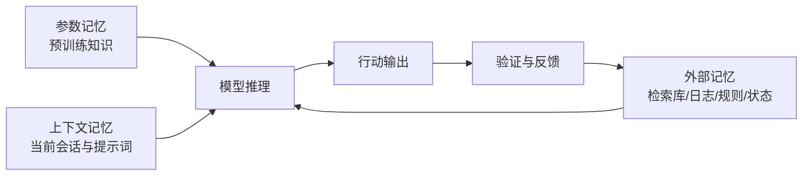
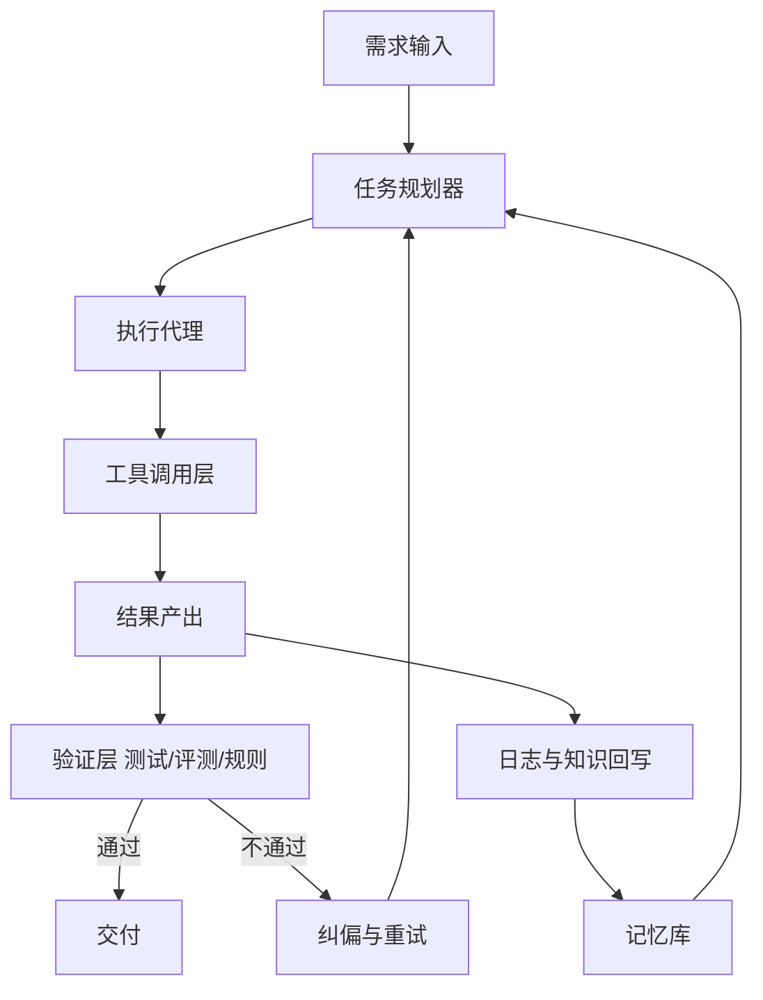
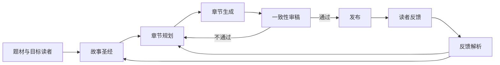

# 从 AI 记忆到 Harness 工程：AI Coding 与应用市场落地探讨

作者：王秉政

## 摘要  
截至 2026 年上半年，行业热点正在从“参数规模竞赛”转向“系统工程竞赛”（以Claude Code源码解析为例）：谁能让模型在复杂业务中稳定、可控、可追责、可持续地产生价值。这个转向背后的核心关键词即—Harness（执行支架/工程托底系统）。

本文从 AI 记忆出发，解释为什么“记忆能力”不能只靠模型本体，为什么 Harness 是将 AI 从“演示能力”推进到“产业能力”的关键；并结合 AI Coding、智能客服、网络文学生成三个场景，给出可落地的架构与实践路径。

## 一、AI 记忆概述：从“模型记得”到“系统记得”  
讨论 Harness 前，先介绍“AI 记忆”，工程里，记忆至少分三层，如下：

第一层是**参数记忆**。模型在预训练中把统计规律压进参数，它提供了广泛常识与语言能力，但问题是不可精确编辑、更新成本高、企业私有知识无法及时进入。

第二层是**上下文记忆**。把文档、对话、代码片段塞进上下文窗口，模型可在当前会话“临时记住”。它的优点是灵活，缺点是脆弱：上下文会被截断、被噪声稀释、被新信息覆盖，长链任务尤其容易丢关键约束。

第三层是**外部记忆**，包括检索库、知识图谱、任务日志、工具状态、测试结果、用户画像、历史决策记录。它不依赖模型参数，能被版本化、审计、纠错、回写，是企业真正可运营的记忆资产。

将记忆从模型内部解耦到系统外部，再通过工程机制实时喂给模型并验证结果，这是 Harness 思路的起点。



## 二、什么是 Harness？

Harness 的本质是：把模型放进一个可约束、可验证、可纠偏、可积累的执行环境。

可以用一句工程化公式理解：  **业务结果 = 模型能力 × 上下文质量 × 工具执行力 × 反馈闭环强度**  。这四项里，模型能力是基座，但后三项主要由 Harness 决定。

成熟 Harness 通常包含六个核心部件：  
1. **任务编排**：把复杂目标拆成可执行步骤，而不是一次性“让模型自己想完”。  
2. **记忆层**：把业务知识、历史动作、失败样例结构化存储并可检索。  
3. **工具层**：让模型能调用真实系统（代码仓库、工单、CRM、支付、数据库、浏览器）。  
4. **约束层**：规则、权限、合规、风控、格式契约，限制高风险输出。  
5. **验证层**：测试、评测器、审查器、回归检查，判断“是否做对”。  
6. **观测层**：全链路日志、指标、追踪与可解释记录，支持定位与迭代。

所以，Harness 是“让模型在业务世界中更可靠地工作”。

## 三、Harness 解决了什么问题  
在没有 Harness 的情况下，AI应用常见四类痛点：

第一，**一次性成功率低**。模型首答可能看起来像对，但缺少可执行验证，容易“貌似合理、实则错误”。  

第二，**跨轮一致性差**。今天回答一套，明天回答另一套，团队无法建立稳定 SOP。  

第三，**知识不可沉淀**。每次会话像一次性消耗，失败教训不会自动转化为下一次成功条件。  

第四，**责任边界不清**。出问题时难以追溯是模型错、数据错、规则错，还是流程错。

Harness 的价值在于：把“概率输出”改造为“工程系统输出”。它不承诺零错误，但能把错误变得可发现、可复现、可修复、可预防。

## 四、约束会不会让 AI 更不准？
一个常见质疑是：规则越多，模型负担越大，会不会反而不准？  答案是：**约束与准确性通常不是线性关系，而是先升后降。**

适度约束会提升准确率，因为它缩小搜索空间，减少模型在无关方向发散；同时通过测试和评测器形成外部纠偏。过度约束会降低准确率，因为会出现规则冲突、上下文拥堵、过时规则压制新事实、目标被“合规形式”绑架等问题。

这可以用偏差-方差直觉理解：  
- 无约束时，模型高方差，结果飘。  
- 适度约束时，方差下降且偏差可控，整体最好。  
- 过度约束时，系统性偏差上升，出现“按规则答错”的情况。

因此，Harness 设计的关键不是“加更多约束”，而是“加对约束”：高价值、可验证、可维护、优先级清晰。

## 五、原理：Harness 如何让 AI 从“会答题”变成“会干活”  
### 1）计划先行与任务分解  
复杂任务要先拆解再执行。AI Coding 场景中，先产出计划文档，再按实现单元推进，可显著降低返工。拆解不是形式主义，它让每步都有输入、输出与验收标准。

### 2）检索增强与记忆回写  
执行前检索历史方案、代码模式、失败复盘；执行后把新经验回写知识库。没有“回写”，系统只会重复犯错；没有“检索”，系统只会重复试错。

### 3）工具调用即行动扩展  
模型本体只能生成文本，真正业务价值来自工具调用：改代码、跑测试、查订单、发工单、更新状态。Harness 让模型拥有“行动能力”，并且所有行动可追踪。

### 4）验证驱动而非自我宣称  
“我已经修好了”不是结果，测试通过、指标改善、人工抽检通过才是结果。Harness 的验证器相当于客观裁判，避免模型“自我感觉正确”。

### 5）在线观测与策略迭代  
把每次失败分类型：知识缺失、检索失效、工具异常、规则冲突、模型推理失误。这样下一轮优化有抓手，而不是盲目换模型。



### 最小可运行闭环（TypeScript 示例）

下面这段 TypeScript体现了 Harness 的核心流程：**规划 -> 检索 -> 执行 -> 验证 -> 回写**。

```ts
type Task = {
  id: string;
  goal: string;
  constraints: string[];
  maxRetries: number;
};

type Plan = { steps: string[] };
type MemoryPack = { docs: string[]; pastFailures: string[]; policies: string[] };
type ActionResult = { ok: boolean; output: string; toolLogs: string[] };
type VerifyResult = { pass: boolean; score: number; reasons: string[] };

interface HarnessDeps {
  plan(task: Task): Promise<Plan>;
  retrieve(task: Task, plan: Plan): Promise<MemoryPack>;
  act(task: Task, plan: Plan, memory: MemoryPack): Promise<ActionResult>;
  verify(task: Task, result: ActionResult): Promise<VerifyResult>;
  writeBack(input: {
    task: Task;
    plan: Plan;
    result: ActionResult;
    verify: VerifyResult;
  }): Promise<void>;
}

export async function runHarness(task: Task, deps: HarnessDeps) {
  const plan = await deps.plan(task);
  const memory = await deps.retrieve(task, plan);

  for (let attempt = 1; attempt <= task.maxRetries; attempt++) {
    const result = await deps.act(task, plan, memory);
    const verify = await deps.verify(task, result);

    await deps.writeBack({ task, plan, result, verify });

    if (verify.pass) {
      return {
        status: "success" as const,
        attempt,
        score: verify.score,
        output: result.output,
      };
    }
  }

  return {
    status: "failed" as const,
    reason: "exceed max retries; escalate to human reviewer",
  };
}
```

在工程落地里，这段代码可直接映射到团队流程：
- `plan` 对应需求结构化与任务拆分。  
- `retrieve` 对应 RAG、历史方案、规则库读取。  
- `act` 对应 AI Coding、客服动作执行、内容生成。  
- `verify` 对应测试、风控、质量评估。  
- `writeBack` 对应经验沉淀与持续优化。

## 六、AI Coding 的落地：从“写代码”升级为“交付能力”  
AI Coding 不是把程序员替换成提示词输入员，而是把研发流程重构成“模型可协作”的形态。一个可执行的落地框架如下。

第一步，**需求结构化**。将业务目标、边界条件、验收标准写成统一模板，避免“口头需求 + 模型脑补”。  

第二步，**计划工件化**。输出计划文档，明确改动范围、依赖、测试策略与风险点。  

第三步，**实现单元化**。按实现单元推进，控制每次改动的 blast radius。  

第四步，**评审自动化**。引入多维评审器：正确性、安全性、可维护性、测试覆盖。 

第五步，**经验资产化**。把“为什么这么改、踩过什么坑、下次如何避免”写入可检索知识库。

流程里，Harness 带来的提效是三项复合收益：  
- 需求到上线的总周期缩短（返工减少）。  
- 缺陷泄漏率下降（验证前移）。  
- 新人上手更快（知识可检索复用）。

## 七、应用市场落地一：智能客服如何用 Harness 从“会答”到“会办”  
智能客服是最适合 Harness 的场景之一，它同时要求速度、准确、合规和可追责。

### 业务挑战  
客服并不只是问答。它涉及身份校验、订单状态、退款规则、优惠政策、工单流转、情绪安抚、风险识别。纯聊天模型很容易在高压场景下“回答像人、执行像空气”。

### Harness 设计要点  
1. **记忆分层**：静态知识（政策库）、动态状态（订单/工单）、会话记忆（用户上下文）分开管理。  
2. **动作白名单**：什么可以自动执行，什么必须升级人工，必须有明确边界。  
3. **合规护栏**：敏感话术、法律风险、隐私字段全部规则化检查。  
4. **结果验证**：关键动作必须二次确认与日志留痕。  
5. **失败回写**：把误答案例与升级路径回写，持续优化。

### 落地效果  
成熟方案通常能把 AI 客服从“FAQ 助手”升级为“可办理事务的前台代理”。  

关键不是追求“完全替代人工”，而是让 AI 稳定接住高频标准流程，把人工聚焦在复杂与高风险场景。  

最终指标应关注：一次解决率、转人工率、平均处理时长、用户满意度、合规事件数。

## 八、应用市场落地二：网络小说生成如何用 Harness 解决“长文一致性”  
写网文看似是创作问题，本质上是一个“超长上下文一致性工程”。

没有 Harness，模型常见问题是人设漂移、时间线错乱、战力体系崩坏、伏笔回收失败。

### 场景痛点  
- 角色设定在 20 章后被模型忘记。  
- 世界观规则前后冲突。  
- 章节节奏忽快忽慢。  
- 同一人物语言风格断裂。  
- 热门标签命中但叙事稳定性不足。

### Harness 设计要点  
1. **故事**：角色卡、世界观、势力关系、硬规则。  
2. **时间线引擎**：事件图谱与状态机，保证因果链连续。  
3. **章节规划器**：每 5-10 章有中期目标和冲突升级路径。  
4. **一致性审稿器**：自动检查人设、术语、设定冲突。  
5. **读者反馈回写**：评论信号进入后续剧情调参，不改核心设定。

### 商业价值  
Harness 让“单章爆发”升级为“长线连载能力”。  对平台来说，真正的竞争力不是某章写得多华丽，而是持续产出稳定故事资产，降低断更与崩盘概率，提高完读率、追更率与生命周期收益。



## 九、为什么Harness对“AI 应用市场”重要  
应用市场竞争正在从“谁先接入大模型”进入“谁能稳定跑业务闭环”。  今天同一底模可被很多公司调用，差异化不再只在模型本身，而在 Harness 的深度：谁的流程更稳、记忆更准、验证更强、迭代更快。

这意味着产品战略也要变化：  
- 过去卖“对话能力”；现在卖“可交付结果”。  
- 过去比“演示观感”；现在比“长期 ROI”。  
- 过去以模型为中心；现在以场景闭环为中心。

## 结语  
AI 时代真正稀缺的不是“会调一个好 Prompt”，而是“能把模型能力变成可持续业务能力”的系统工程力。

  从记忆视角看，Harness 的意义是把易失、偶然、不可追踪的对话结果，转化为可积累、可验证、可复制的组织能力；

从产业视角看，Harness让 AI 应用从“好看演示”走向“稳定生产”；从落地视角看，它让 AI Coding、智能客服、网文生成这类看似不同的场景，拥有同一种底层方法论：**记忆外置、约束清晰、验证闭环、持续回写**。  

## 参考文献

- OpenAI, Harness Engineering: https://openai.com/index/harness-engineering/
- OpenAI, Unlocking the Codex Harness: https://openai.com/index/unlocking-the-codex-harness/
- EveryInc Compound Engineering Plugin: https://github.com/EveryInc/compound-engineering-plugin
- SWE-bench: https://www.swebench.com/
- Anthropic, Building Effective Agents: https://www.anthropic.com/engineering/building-effective-agents
